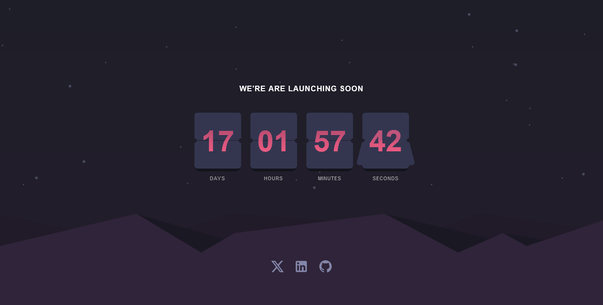

# Frontend Mentor - Launch countdown timer solution

This is a solution to the [Launch countdown timer challenge on Frontend Mentor](https://www.frontendmentor.io/challenges/launch-countdown-timer-N0XkGfyz-). Frontend Mentor challenges help you improve your coding skills by building realistic projects.

## Table of contents

- [Overview](#overview)
  - [The challenge](#the-challenge)
  - [Screenshot](#screenshot)
  - [Links](#links)
- [My process](#my-process)
  - [Built with](#built-with)
  - [What I learned](#what-i-learned)
- [Author](#author)
- [Acknowledgments](#acknowledgments)

## Overview

### The challenge

Users should be able to:

- See hover states for all interactive elements on the page
- See a live countdown timer that ticks down every second (start the count at 14 days)
- **Bonus**: When a number changes, make the card flip from the middle

### Screenshot

### Links

- Solution URL: [Add solution URL here](https://your-solution-url.com)
- Live Site URL: [Add live site URL here](https://your-live-site-url.com)

## My process

### Built with

- Mobile-first workflow
- [React](https://reactjs.org/) - JS library
- Snowpack

### What I learned

1. Understanding CSS Perspective
2. Utilizing Transform Property: The 'transform' property, particularly 'rotateX()', allows for the rotation of elements along the X-axis, creating a flip animation effect.

## Author

- Website - [Ikenna Richard](https://ikennarichard.vercel.app)
- Frontend Mentor - [@ikennarichard](https://www.frontendmentor.io/profile/ikennarichard)
- Twitter - [@ikennarichard_](https://www.twitter.com/ikennarichard_)

## Acknowledgments

- Frontend Mentor
- webdev simplified
